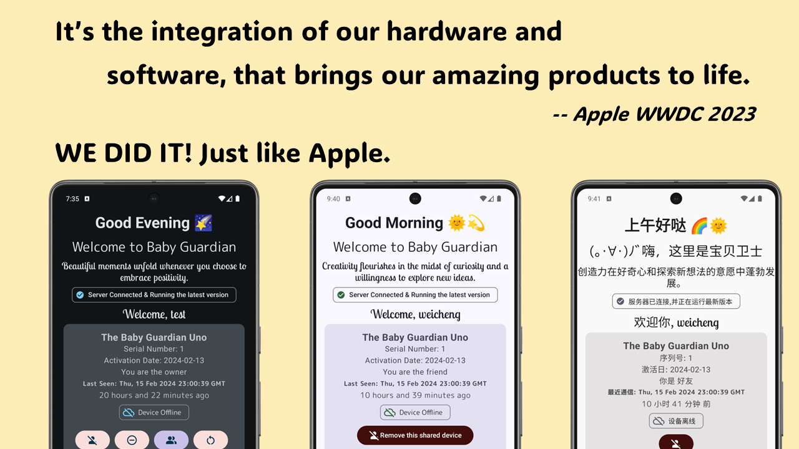
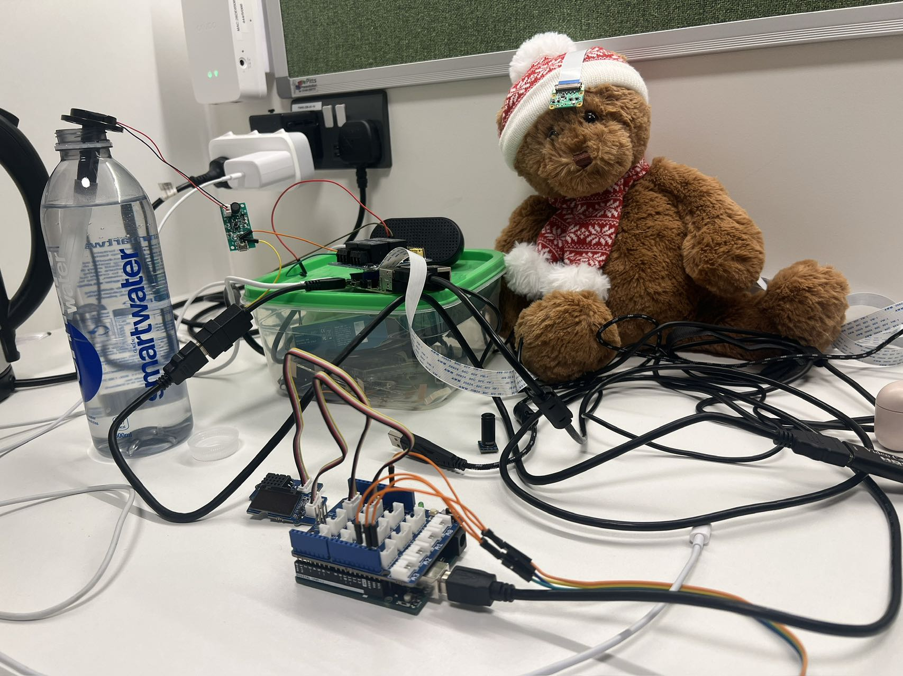
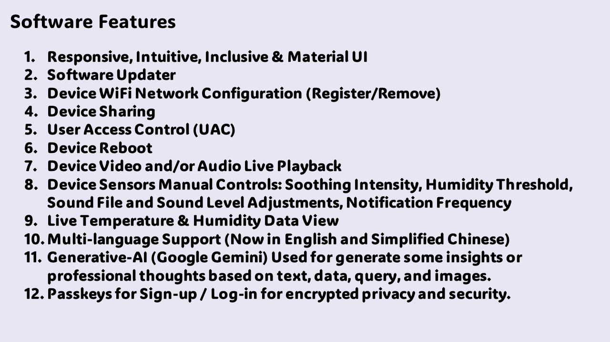
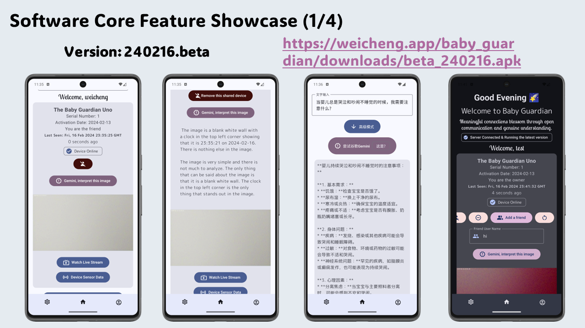
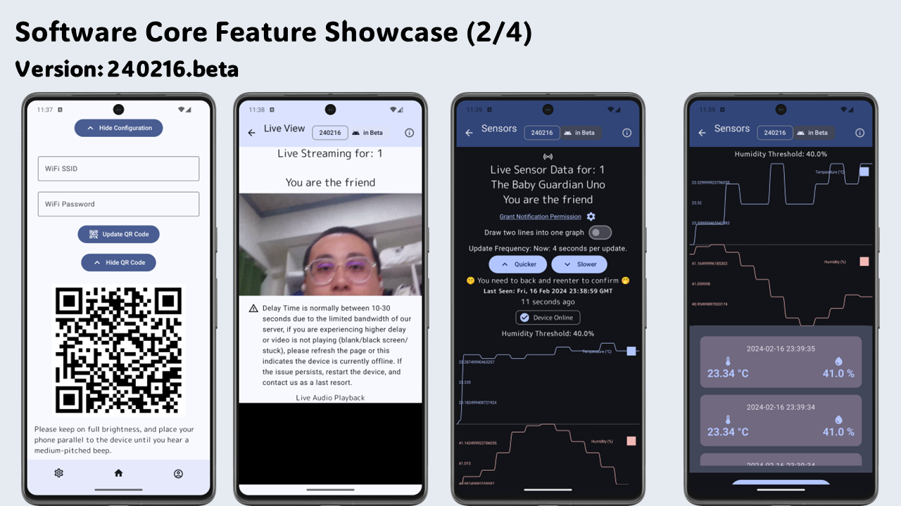
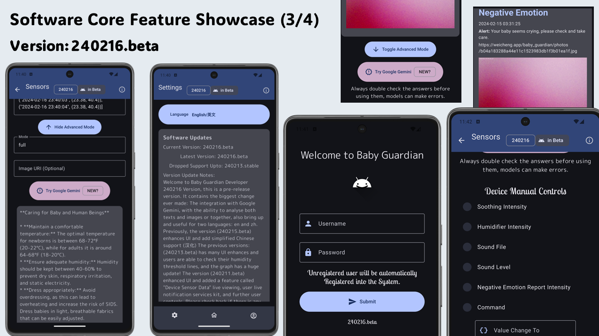
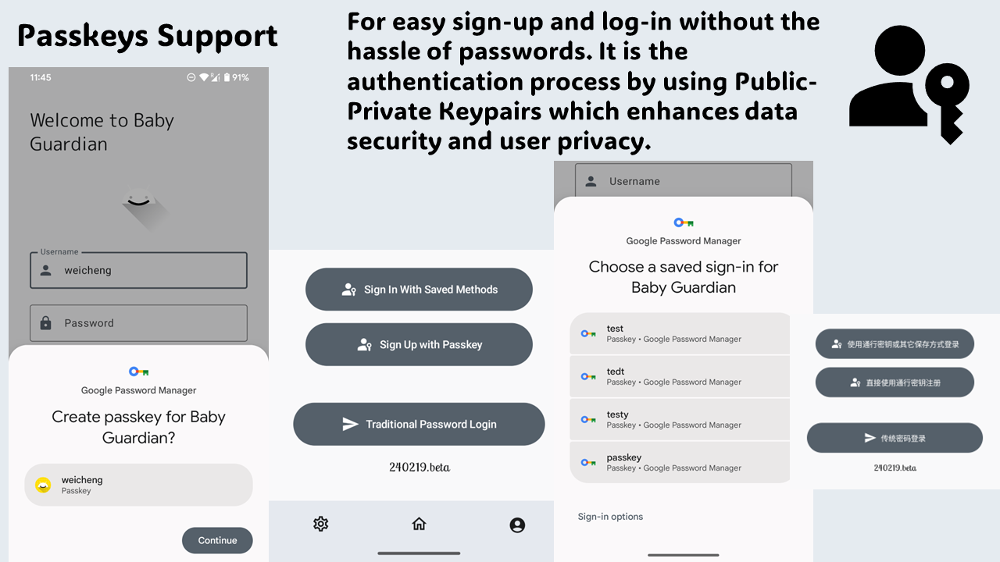

# Baby-Guardian App

## Overview

Welcome to Baby-Guardian, a cutting-edge Android application built natively with **Jetpack Compose** in Kotlin. This app is designed to provide a comprehensive set of features to ensure the safety and well-being of your baby. From real-time monitoring to advanced controls, Baby-Guardian offers a seamless and intuitive experience.

This App is designed for a course called "Designing Sensor Systems", and it is the **companion software** App designed by me with the collaboration with GPT3.5, to coordinate with our paired hardware and trained machine learning models, and the server.

The hardware designed to interact with is: Raspberry Pi 4B with Raspberry Pi OS, Arduino Uno with Temperature and Humidity Sensors.

## Beta Release Notes

https://weicheng.app/baby_guardian/downloads/baby_guardian_apis_240219.pdf

## Features

### Responsive, Intuitive, Inclusive & Material UI

Baby-Guardian boasts a user-friendly interface that adapts to various screen sizes, ensuring a responsive experience. The design prioritizes intuitiveness for users of all levels, making it inclusive for everyone. The Material UI components contribute to a visually pleasing and consistent design language.

### Software Updater

Stay up-to-date with the latest features and improvements through our built-in software updater. Baby-Guardian ensures that you have access to the most advanced functionalities and security enhancements.

### Device WiFi Network Configuration (Register/Remove)

Effortlessly manage your device's WiFi connections with the ability to register or remove networks directly from the app. This feature provides flexibility and convenience for maintaining a secure connection.

### Device Sharing

Facilitate collaboration and caregiving by easily sharing access to the Baby-Guardian app with trusted individuals. This feature promotes a collective approach to baby monitoring.

### User Access Control (UAC)

Ensure privacy and security by controlling user access through robust User Access Control mechanisms. Set permissions and restrictions to tailor the app to your specific needs.

### Device Reboot

Maintain optimal performance by remotely rebooting your device when necessary. This feature is handy for troubleshooting and ensuring continuous functionality.

### Device Video and/or Audio Live Playback

Experience real-time monitoring with live video and/or audio playback. Keep an eye on your baby and listen in to ensure their safety and comfort.

### Device Sensors Manual Controls

Fine-tune your baby's environment with manual controls for soothing intensity, humidity threshold, sound file, sound level adjustments, and notification frequency. Customize the settings to create the perfect environment for your baby.

### Live Temperature & Humidity Data View

Monitor your baby's surroundings in real-time with live temperature and humidity data. Stay informed about the comfort level of the environment.

### Multi-language Support

Baby-Guardian supports multiple languages, including English and Simplified Chinese, ensuring a global and diverse user base can utilize the app seamlessly.

### Generative-AI (Google Gemini)

Leverage the power of Generative-AI, specifically Google Gemini, to generate insights and professional thoughts based on text, data, queries, and images. Enhance your caregiving experience with intelligent recommendations.

### Passkeys for Sign-up / Log-in

Prioritize privacy and security with passkeys for sign-up and log-in. Encrypt sensitive information to ensure a secure connection and protect your baby's data.

## Baby Guardian Back-end (Pi-side with services and Server-side)

pi-services should be installed to "/etc/systemd/system".

back-end files are intended to be used and configured on a remote server that you own.

pi-side files should be put under "/home/baby/Desktop", please follow the same folder structure.

## Getting Started

Clone this project by using your ssh keys first, then navigate to the "android" folder, this is the source code of the project so far.

To use Baby-Guardian, you can try https://weicheng.app/baby_guardian/downloads/beta_240219.apk, and since this App needs to be used together with hardware (Raspberry Pi 4B with Arduino Sensors for data collection), you might not be able to fully hands-on this. Should you have any question please contact me at weicheng.ao@outlook.com or directly opens a pull request.

## Feedback

We value your feedback! If you have any suggestions, bug reports, or feature requests, please reach out to us through the app's support channels.

Baby-Guardian - Keeping your baby safe, one smart feature at a time.